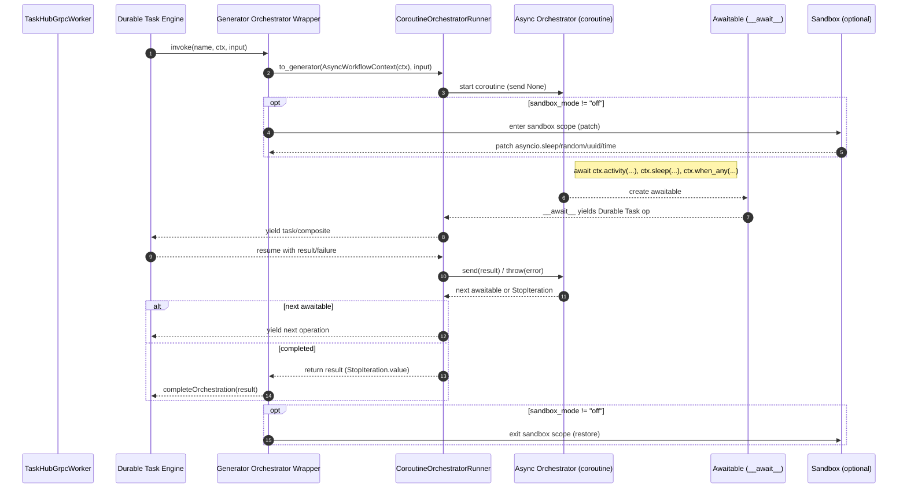

# Durable Task AsyncIO Internals

This document explains how the AsyncIO implementation in this repository integrates with the existing generator‑based Durable Task runtime. It covers the coroutine→generator bridge, awaitable design, sandboxing and non‑determinism detection, error/cancellation semantics, debugging, and guidance for extending the system.

## Scope and Goals

- Async authoring model for orchestrators while preserving Durable Task's generator runtime contract
- Deterministic execution and replay correctness first
- Optional, scoped compatibility sandbox for common stdlib calls during development/test
- Minimal surface area changes to core non‑async code paths

Key modules:
- `durabletask/aio/context.py` — Async workflow context and deterministic utilities
- `durabletask/aio/driver.py` — Coroutine→generator bridge
- `durabletask/aio/sandbox.py` — Scoped patching and non‑determinism detection

## Architecture Overview

### Coroutine→Generator Bridge

Async orchestrators are authored as `async def` but executed by Durable Task as generators that yield `durabletask.task.Task` (or composite) instances. The bridge implements a driver that manually steps a coroutine and converts each `await` into a yielded Durable Task operation.

High‑level flow:
1. `TaskHubGrpcWorker.add_async_orchestrator(async_fn, sandbox_mode=...)` wraps `async_fn` with a `CoroutineOrchestratorRunner` and registers a generator orchestrator with the worker.
2. At execution time, the runtime calls the registered generator orchestrator with a base `OrchestrationContext` and input.
3. The generator orchestrator constructs `AsyncWorkflowContext` and then calls `runner.to_generator(async_fn_ctx, input)` to obtain a generator.
4. The driver loop yields Durable Task operations to the engine and sends results back into the coroutine upon resume, until the coroutine completes.

Driver responsibilities:
- Prime the coroutine (`coro.send(None)`) and handle immediate completion
- Recognize awaitables whose `__await__` yield driver‑recognized operation descriptors
- Yield the underlying Durable Task `task.Task` (or composite) to the engine
- Translate successful completions to `.send(value)` and failures to `.throw(exc)` on the coroutine
- Normalize `StopIteration` completions (PEP 479) so that orchestrations complete with a value rather than raising into the worker

### Awaitables and Operation Descriptors

Awaitables in `durabletask.aio` implement `__await__` to expose a small operation descriptor that the driver understands. Each descriptor maps deterministically to a Durable Task operation:

- Activity: `ctx.activity(name, *, input)` → `task.call_activity(name, input)`
- Sub‑orchestrator: `ctx.sub_orchestrator(fn_or_name, *, input)` → `task.call_sub_orchestrator(...)`
- Timer: `ctx.sleep(duration)` → `task.create_timer(fire_at)`
- External event: `ctx.wait_for_external_event(name)` → `task.wait_for_external_event(name)`
- Concurrency: `ctx.when_all([...])` / `ctx.when_any([...])` → `task.when_all([...])` / `task.when_any([...])`

Design rules:
- Awaitables are single‑use. Each call creates a fresh awaitable whose `__await__` returns a fresh iterator. This avoids "cannot reuse already awaited coroutine" during replay.
- All awaitables use `__slots__` for memory efficiency and replay stability.
- Composite awaitables convert their children to Durable Task tasks before yielding.

### AsyncWorkflowContext

`AsyncWorkflowContext` wraps the base generator `OrchestrationContext` and exposes deterministic utilities and async awaitables.

Provided utilities (deterministic):
- `now()` — orchestration time based on history
- `random()` — PRNG seeded deterministically (e.g., instance/run ID); used by `uuid4()`
- `uuid4()` — derived from deterministic PRNG
- `is_replaying`, `is_suspended`, `workflow_name`, `instance_id`, etc. — passthrough metadata

Concurrency:
- `when_all([...])` returns an awaitable that completes with a list of results
- `when_any([...])` returns an awaitable that completes with the first completed child
- `when_any_with_result([...])` returns `(index, result)`
- `with_timeout(awaitable, seconds|timedelta)` wraps any awaitable with a deterministic timer

Debugging helpers (dev‑only):
- Operation history when debug is enabled (`DAPR_WF_DEBUG=true` or `DT_DEBUG=true`)
- `get_debug_info()` to inspect state for diagnostics

### Error and Cancellation Semantics

- Activity/sub‑orchestrator completion values are sent back into the coroutine. Final failures are injected via `coro.throw(...)`.
- Cancellations are mapped to `asyncio.CancelledError` where appropriate and thrown into the coroutine.
- Termination completes orchestrations with TERMINATED status (matching generator behavior); exceptions are surfaced as failureDetails in the runtime completion action.
- The driver consumes `StopIteration` from awaited iterators and returns the value to avoid leaking `RuntimeError("generator raised StopIteration")`.

## Sequence Diagram

### Mermaid (rendered in compatible viewers)



### ASCII Flow (fallback)

```text
Engine → Wrapper → Runner → Coroutine
  │         │         │         ├─ await ctx.activity(...)
  │         │         │         ├─ await ctx.sleep(...)
  │         │         │         └─ await ctx.when_any([...])
  │         │         │
  │         │         └─ Awaitable.__await__ → yields Durable Task op
  │         └─ yield op → Engine schedules/waits
  └─ resume with result → Runner.send/throw → Coroutine step

Loop until coroutine returns → Runner captures StopIteration.value →
Wrapper returns value → Engine emits completeOrchestration

Optional Sandbox (per activation):
  enter → patch asyncio.sleep/random/uuid/time → run step → restore
```

## Sandboxing and Non‑Determinism Detection

The sandbox provides optional, scoped compatibility and detection for common non‑deterministic stdlib calls. It is opt‑in per orchestrator via `sandbox_mode`:

- `off` (default): No patching or detection; zero overhead. Use deterministic APIs only.
- `best_effort`: Patch common functions within a scope and emit warnings on detected non‑determinism.
- `strict`: As above, but raise `SandboxViolationError` on detected calls.

Patched targets (best‑effort):
- `asyncio.sleep` → deterministic timer awaitable
- `random` module functions (via a deterministic `Random` instance)
- `uuid.uuid4` → derived from deterministic PRNG
- `time.time/time_ns` → orchestration time

Important limitations:
- `datetime.datetime.now()` is not patched (type immutability). Use `ctx.now()` or `ctx.current_utc_datetime`.
- `from x import y` may bypass patches due to direct binding.
- Modules that cache callables at import time won’t see patch updates.
- This does not make I/O deterministic; all external I/O must be in activities.

Detection engine:
- `_NonDeterminismDetector` tracks suspicious call sites using Python frame inspection
- Deduplicates warnings per call signature and location
- In strict mode, raises `SandboxViolationError` with actionable suggestions; in best‑effort, issues `NonDeterminismWarning`

### Detector: What, When, and Why

What it checks:
- Calls to common non‑deterministic functions (e.g., `time.time`, `random.random`, `uuid.uuid4`, `os.urandom`, `secrets.*`, `datetime.utcnow`) in user code
- Uses a lightweight global trace function (installed only in `best_effort` or `strict`) to inspect call frames and identify risky callsites
- Skips internal `durabletask` frames and built‑ins to reduce noise

Modes and behavior:
- `SandboxMode.OFF`:
  - No tracing, no patching, zero overhead
  - Detector is not active
- `SandboxMode.BEST_EFFORT`:
  - Patches selected stdlib functions
  - Installs tracer only when `ctx._debug_mode` is true; otherwise a no‑op tracer is used to keep overhead minimal
  - Emits `NonDeterminismWarning` once per unique callsite with a suggested deterministic alternative
- `SandboxMode.STRICT`:
  - Patches selected stdlib functions and blocks dangerous operations (e.g., `open`, `os.urandom`, `secrets.*`)
  - Installs full tracer regardless of debug flag
  - Raises `SandboxViolationError` on first detection with details and suggestions

When to use it (recommended):
- During development to quickly surface accidental non‑determinism in orchestrator code
- When integrating third‑party libraries that might call time/random/uuid internally
- In CI for a dedicated “determinism” job (short test matrix), using `BEST_EFFORT` for warnings or `STRICT` for enforcement

When not to use it:
- Production environments (prefer `OFF` for zero overhead)
- Performance‑sensitive local loops (e.g., microbenchmarks) unless you are specifically testing detection overhead

Enabling and controlling the detector:
- Per‑orchestrator registration:
```python
from durabletask.aio import SandboxMode

worker.add_orchestrator(my_async_orch, sandbox_mode=SandboxMode.BEST_EFFORT)
```
- Scoped usage in advanced scenarios:
```python
from durabletask.aio import sandbox_best_effort

async def my_async_orch(ctx, _):
    with sandbox_best_effort(ctx):
        # code here benefits from patches + detection
        ...
```
- Debug gating (best_effort only): set `DAPR_WF_DEBUG=true` (or `DT_DEBUG=true`) to enable full detection; otherwise a no‑op tracer is used to minimize overhead.
- Global disable (regardless of mode): set `DAPR_WF_DISABLE_DETECTION=true` to force `OFF` behavior without changing code.

What warnings/errors look like:
- Warning (`BEST_EFFORT`):
  - Category: `NonDeterminismWarning`
  - Message includes function name, filename:line, the current function, and a deterministic alternative (e.g., “Use `ctx.now()` instead of `datetime.utcnow()`).
- Error (`STRICT`):
  - Exception: `SandboxViolationError`
  - Includes violation type, suggested alternative, `workflow_name`, and `instance_id` when available

Overhead and performance:
- `OFF`: zero overhead
- `BEST_EFFORT`: minimal overhead by default; full detection overhead only when debug is enabled
- `STRICT`: tracing overhead present; recommended only for testing/enforcement, not for production

Limitations and caveats:
- Direct imports like `from random import random` bind the function and may bypass patching
- Libraries that cache function references at import time will not see patch changes
- `datetime.datetime.now()` cannot be patched; use `ctx.now()` instead
- The detector is advisory; it cannot prove determinism for arbitrary code. Treat it as a power tool for finding common pitfalls, not a formal verifier

Quick mapping of alternatives:
- `datetime.now/utcnow` → `ctx.now()` (async) or `ctx.current_utc_datetime`
- `time.time/time_ns` → `ctx.now().timestamp()` / `int(ctx.now().timestamp() * 1e9)`
- `random.*` → `ctx.random().*`
- `uuid.uuid4` → `ctx.uuid4()`
- `os.urandom` / `secrets.*` → `ctx.random().randbytes()` (or move to an activity)

Troubleshooting tips:
- Seeing repeated warnings? They are deduplicated per callsite; different files/lines will warn independently
- Unexpected strict errors during replay? Confirm you are not creating background tasks (`asyncio.create_task`) or performing I/O in the orchestrator
- Need to quiet a test temporarily? Use `sandbox_mode=SandboxMode.OFF` for that orchestrator or `DAPR_WF_DISABLE_DETECTION=true` during the run

## Integration with Generator Runtime

- Registration: `TaskHubGrpcWorker.add_async_orchestrator(async_fn, ...)` registers a generator wrapper that delegates to the driver. Generator orchestrators and async orchestrators can coexist.
- Execution loop remains owned by Durable Task; the driver only yields operations and processes resumes.
- Replay: The driver and awaitables are designed to be idempotent and to avoid reusing awaited iterators; orchestration state is reconstructed deterministically from history.

## Debugging Guide

Enable developer diagnostics:
- Set `DAPR_WF_DEBUG=true` (or `DT_DEBUG=true`) to enable operation logging and non‑determinism warnings.
- Use `ctx.get_debug_info()` to export state, operations, and instance metadata.

Common issues:
- "coroutine was never awaited": Ensure all workflow operations are awaited and that no background tasks are spawned (`asyncio.create_task` is blocked in strict mode).
- "cannot reuse already awaited coroutine": Do not cache awaitables across activations; create them inline. All awaitables in this package are single‑use by design.
- Orchestration hangs: Inspect last yielded operation in logs; verify that the corresponding history event occurs (activity completion, timer fired, external event received). For external events, ensure the event name matches exactly.
- Sandbox leakage: Verify patches are scoped by context manager and restored after activation. Avoid `from x import y` forms in orchestrator code when relying on patching.

Runtime tracing tips:
- Log each yielded operation and each resume result in the driver (behind debug flag) to correlate with sidecar logs.
- Capture `instance_id` and `history_event_sequence` from `AsyncWorkflowContext` when logging.

## Performance Characteristics

- `sandbox_mode="off"`: zero overhead vs generator orchestrators
- `best_effort` / `strict`: additional overhead from Python tracing and patching; use during development and testing
- Awaitables use `__slots__` and avoid per‑step allocations in hot paths where feasible

## Extending the System

Adding a new awaitable:
1. Define a class with `__slots__` and a constructor capturing required arguments.
2. Implement `_to_task(self) -> durabletask.task.Task` that builds the deterministic operation.
3. Implement `__await__` to yield the driver‑recognized descriptor (or directly the task, depending on driver design).
4. Add unit tests for replay stability and error propagation.

Adding sandbox coverage:
1. Add patch/unpatch logic inside `sandbox.py` with correct scoping and restoration.
2. Update `_NonDeterminismDetector` patterns and suggestions.
3. Document limitations and add tests for best‑effort and strict modes.

## Interop Checklist (Async ↔ Generator)

- Activities: identical behavior; only authoring differs (`yield` vs `await`).
- Timers: map to the same `createTimer` actions.
- External events: same semantics for buffering and completion.
- Sub‑orchestrators: same create/complete/fail events.
- Suspension/Termination: same runtime events; async path observes `is_suspended` and maps termination to completion with TERMINATED.

## References

- `durabletask/aio/context.py`
- `durabletask/aio/driver.py`
- `durabletask/aio/sandbox.py`
- Tests under `tests/durabletask/` and `tests/aio/`


